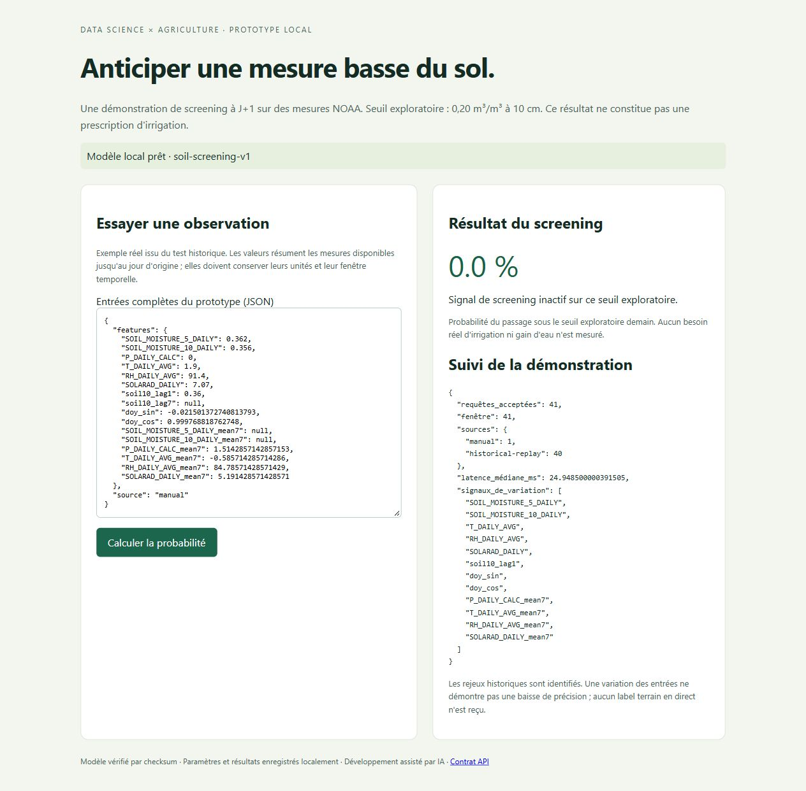

# Agri ML Platform — Local Release & Monitoring

A working local FastAPI dashboard, MLflow experiment tracking, checksum-bound model release and SQLite request monitoring for a measured-soil research model.



## Purpose and evidence

This engineering project reuses the fixed NOAA sensor study from **smart-irrigation-ml**. It does not constitute a second independent model validation. Forecast tomorrow's measured 10 cm moisture crossing an exploratory 0.20 m³/m³ threshold. These reference stations are not verified irrigated fields; no observed irrigation decisions, live field outcomes or measured water savings are available.

27 hash-pinned [NOAA USCRN files](https://www.ncei.noaa.gov/pub/data/uscrn/products/daily01/), 2016–2024, three stations, 9,864 source rows. Train Iowa/Missouri through 2021, validate 2022, test Illinois 2023–2024. Station IDs and future weather are excluded. Preprocessing is fitted on train. The fixed validation-selected Random Forest achieves test positive F1 **0.9302** versus persistence **0.9118**; it generates **13** false alarms versus **9**. Source units, provenance and public-domain terms: [data notes](data/README.md). Code MIT; source terms remain separate.

## Implemented workflow

```text
Pinned source acquisition → fixed benchmark → validation gate
→ actual local MLflow run → hashed artifact + JSON release manifest
→ strict API → SQLite request log → descriptive input-shift dashboard
```

MLflow records actual parameters, metrics and artifacts in a local file tracking store. The release manifest is a local JSON registry; no remote Model Registry or hosted service is claimed. Model loading verifies path containment, feature schema, validation gate and SHA-256 before deserializing trusted locally trained joblib. A checksum detects accidental changes; it does not establish trust in an arbitrary external joblib file.

API rejects extra fields, wrong feature names, booleans, non-finite values and impossible physical ranges. Missing historical inputs may be null; current 10 cm moisture is mandatory. Telemetry records accepted requests, source type, probabilities and model inference latency. PSI compares the last 300 requests with train-only quantile bins, requires 30 finite values per feature and uses 0.2 as a descriptive heuristic. Input variation does not establish accuracy drift without outcome labels. No automatic retraining or promotion is performed.

## Executed local demonstration

[Replay report](reports/replay-monitoring.json): **40 actual historical requests** through the API, explicitly labelled historical-replay. Local TestClient model-inference median **24.90 ms**, p95 **26.12 ms**. These timings exclude network and serialization and are not production throughput or a load benchmark. The first 40 winter days differ from the mixed-year training distribution, so several PSI values are large. Some lagged features lack enough finite values and have no PSI score. The screenshot includes one additional real manual example (41 total requests); it is not live farm traffic.

[Metrics](reports/metrics.json), [executed notebook](notebooks/01_evidence.ipynb), [verification](docs/verification.md), [learning guide](docs/learning-guide.md), [interview notes](docs/interview-notes.md).

## Reproduce (Python 3.12)

```bash
python -m venv .venv
# Activate using your platform's command.
python -m pip install -r requirements-lock.txt
python -m pip install --no-deps -e .
python -m agri_platform.prepare
python scripts/replay_demo.py
python -m pytest -q
python -m uvicorn agri_platform.api:app --host 127.0.0.1 --port 8002
```

Open http://127.0.0.1:8002 and /docs. Run from the repository directory or set AGRI_ROOT to its absolute path. Source cache, tracking store, SQLite log and models are saved locally and excluded from Git. Replays append to the log; rerunning them changes request counts. Start from a clean clone for the reported 40-request demonstration.

A Dockerfile and build/smoke CI job are supplied. Docker is unavailable on the verification machine: local image build and container execution are **unverified**. Once verified, mount locally prepared trusted models into /app/models and use AGRI_ROOT=/app. Public/cloud deployment, authentication and service availability are not implemented. CI is pending scheduled GitHub publication.

Development assisted by AI. Results come from executed code and public source data; the author should understand the supplied learning notes before presenting this portfolio.


## GitHub publication

[Public repository](https://github.com/idrisslemnouni-crypto/agri-ml-platform) · [Current CI results](https://github.com/idrisslemnouni-crypto/agri-ml-platform/actions). Published following the user's explicit 5 October 2026 request to release the prepared portfolio together. Earlier local-verification notes describe the pre-publication checkpoint. Raw sources and trained artifacts remain excluded from Git; reproduction commands regenerate them.
